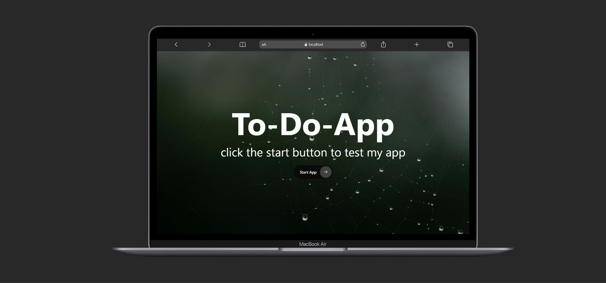
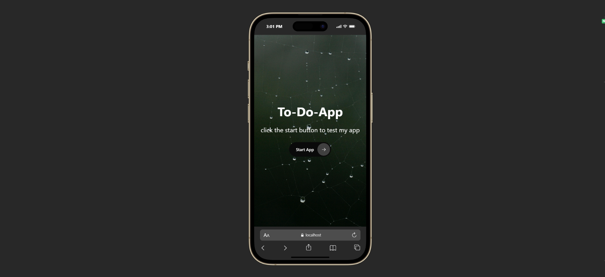

Modern To-Do App

A modern, responsive and feature-rich To-Do application built with React + Context API + Tailwind CSS + React Router.

This project helps users manage daily tasks with a clean UI, progress tracking, and real-time updates.

🚀 Live Demo

👉 https://modern-to-do-app-zeta.vercel.app

📸 Screenshots

💻 Desktop View

📱 Mobile View

✨ Features

➕ Add new tasks
✅ Mark tasks as completed
❌ Delete tasks
📊 Live progress percentage
📌 Total / Done / Left counter
🎯 Dynamic progress bar
⚡ Real-time updates using Context API
🔁 React Router navigation
📱 Fully responsive design

🛠️ Tech Stack

⚛️ React.js
⚡ Vite
🎨 Tailwind CSS
🌍 React Router DOM
🧠 Context API
🆔 Crypto UUID
🎯 React Icons

📂 Project Structure

src/
├── assets/
├── Components/
│ ├── Button.jsx
│ ├── Input.jsx
│ ├── ShowTodo.jsx
│ ├── ShowTotal.jsx
│ ├── ShowPercentage.jsx
│ ├── ToDosOption.jsx
│ └── Home.jsx
├── pages/
│ ├── Home.jsx
│ ├── To-Do.jsx
│ └── NotFound.jsx
├── App.jsx
└── main.jsx

🧠 How It Works

State is managed globally using Context API.

Each task contains:

id
work
isDone
➕ Add Task

A new task is created and added to state.

✅ Complete Task

Checkbox toggles isDone value.

❌ Delete Task

Task is removed using filter method.

📊 Progress System

Progress is calculated using:

Total tasks
Completed tasks
Percentage formula
📈 Progress Bar

🔵 Blue → In progress
🟢 Green → Completed (100%)

🧭 Routing

/ → Home page
/ToDo → Main app

→ 404 page
🎨 UI Design
Dark modern UI
Smooth animations
Responsive layout
Clean card-based design
📦 Installation

## 📸 Screenshots

### 💻 Desktop View

### 📱 Mobile View

git clone https://github.com/RezaFrontEndDeveloper/Modern-To-Do-App
cd modern-to-do-app
npm install
npm run dev

📌 Future Improvements
🌙 Dark/Light mode
🌍 Multi language (FA / EN)
💾 LocalStorage support
🏷️ Task priority system
🔔 Notifications
👨‍💻 Author

Built with ❤️ by Reza Frontend Developer

⭐ If you like this project

Give it a ⭐ on GitHub 👍
